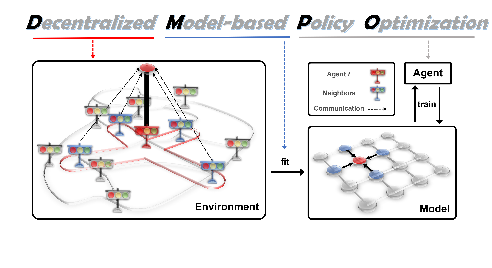

Official PyTorch implementation of the paper "Scalable Model-based Policy Optimization for Decentralized Networked Systems", accepted by The 2022 IEEE/RSJ International Conference on Intelligent Robots and Systems (IROS 2022)

Paper link: [Scalable Model-based Policy Optimization for Decentralized Networked Systems](https://ieeexplore.ieee.org/abstract/document/9982253)


# Algorithms
1. DMPO (Decentralized Model-based PO, Our method)
2. DPPO (Decentralized PPO)
3. CPPO (Centralized PPO)
4. IC3Net (Individualized Controlled Continuous Communication Model)
5. IA2C (Independent Advantage Actor-Critic)

Key parameters for decentralized algorithms:
1. radius_v: communication radius for value function, 1,2,3....
2. radius_pi: communication radius for policy, default 1
3. radius_p: communication radius for environment model, default 1

    
# Environments
1. CACC Catchup
2. CACC Slowdown
3. Ring Attenuation
4. Figure Eight
5. ATSC Grid
6. ATSC Monaco
7. UAVFC (will be available soon)
8. Custom Environments

# Environment setup
## CACC, Flow and ATSC Environments
CACC, Flow and ATSC are developed based on Sumo, you need to install the corresponding version of sumo as follows:
1. SUMO installation. Version 1.11.0

The commit number of SUMO, available at https://github.com/eclipse/sumo used to run the results is 2147d155b1.
To install SUMO, you are recommended to refer to https://sumo.dlr.de/docs/Installing/Linux_Build.html to install the specific version via repository checkout. Note that the latest version of SUMO is not compatible with Flow environments.
In brief, after you checkout to that version, run the following command to build the SUMO binaries.
```
sudo apt-get install cmake python g++ libxerces-c-dev libfox-1.6-dev libgdal-dev libproj-dev libgl2ps-dev swig
cd <sumo_dir> # please insert the correct directory name here
export SUMO_HOME="$PWD"
mkdir build/cmake-build && cd build/cmake-build
cmake ../..
make -j$(nproc)
```
After building, you need to manually ad the bin folder into your path:
```
export PATH=$PATH:$SUMO_HOME/bin
```

2. Setting up the environment.

It's recommended to set up the environment via Anaconda. The environment specification is in environment.yml.
After installing the required packages, run
```
export PYTHONPATH="$SUMO_HOME/tools:$PYTHONPATH"
```
in terminal to include the SUMO python packages.

## Custom Environments
We support both discrete and continuous action spaces. Similar to gym, you need to write reset and step functions. For more details please see algorithms/envs/Custom_Env.py

1. reset (): 
```
Input: None
Output: State → np.array((number of agent, dimension of state))
```
2. step (action): 
```
Input: Action → np.array((number of agent, dimension of action))
Output: State → np.array((number of agent, dimension of action)), Reward → np.array((number of agent,)), Done → np.array((number of agent,))
```
3. You need to create a parameter file such as Catchup_CPPO.py in algorithms/config

## Logging data during training
We uses WandB as logger. 
1. Setting up WandB.

Before running our code, you should log in to WandB locally. Please refer to https://docs.wandb.ai/quickstart for more detail.

# Usage
Train the agent by:
```python
python launcher.py --env ENV --algo ALGO --device DEVICE
```
`ENV` specifies which environment to run in, including `eight`, `ring`, `catchup`, `slowdown`, `Grid`, `Monaco`, `custom_env_name`.

`ALGO` specifies the algorithm to use, including `IC3Net`, `CPPO`, `DPPO`, `DMPO`, `IA2C`.

`DEVICE` specifies the device to use, including `cpu`, `cuda:0`, `cuda:1`, `cuda:2`...

such as:
```python
python launcher.py --env 'slowdown' --algo 'DMPO' --device 'cuda:0'
```
```python
python launcher.py --env 'catchup' --algo 'DPPO' --device 'cuda:0'
```

Test the agent by:

After trainging, the actors model will be saved in checkpoints/standard _xxx/Models/xxxbest_actor.pt,
You just need to add following code in algorithms/algo/agent/DPPO.py(DMPO.py/CPPO.py/...):
```python
self.actors.load_state_dict(torch.load(test_actors_model))
```
after initializing actors:
```python
self.collect_pi, self.actors = self._init_actors()
```
where:
```python
test_actors_model = 'checkpoints/standard _xxx/Models/xxxbest_actor.pt'
```


# Results in video form
## Description of the following videos in Figure Eight
Our model controls the formation of queues to cross intersection with an orderly process of accelerating to the target velocity and then decelerating to the safe velocity near 0 m/s. We conclude that our models control vehicles to obey traffic rules while improving the efficiency of the overall traffic flow.

### Execution result of DMPO(Our method) in Figure Eight
https://user-images.githubusercontent.com/100258046/211249589-54013fc4-d36e-4625-8b56-09c66acd47ac.mp4

## Description of the following videos in Ring Attenuation
Our model can maintain the stability of the ring traffic flow and improve the efficiency of the overall traffic flow.
### Execution result of DMPO(Our method) in Ring Attenuation
https://user-images.githubusercontent.com/100258046/215239512-c0c643dc-131c-40bd-9278-3d714e8b506a.mp4


## Description of the following videos in ATSC-Grid


This is the network structure of 5*5 intersections in ATSC-Grid. The highlighted areas of the red frame are shown in the following videos and they are also the key area for displaying execution result in DPPO and DMPO. Through the key indicator "Insertion-backlogged vehicles" in the numerical panel on the left, we can observe that "Insertion-backlogged vehicles" will gradually increase with the load of the traffic flow, and then gradually decrease with the effective decision of the traffic light. The maximum value of this indicator is 1486 vehs in DPPO and 1033 vehs in DMPO, which indicates that DMPO can reduce the backlog of vehicles at intersections. Therefore, compared with DPPO, DMPO is more effective in solving traffic jams. Through the three intersections we focused on in the video, we can also observe that DMPO can make traffic jams last for less time.


### Execution result of DPPO(Decentralized PPO) in ATSC-Grid
https://user-images.githubusercontent.com/100258046/163685533-f85cd0ba-a3f6-457c-a35f-e13bfbe47481.mp4

### Execution result of DMPO(Our method) in ATSC-Grid
https://user-images.githubusercontent.com/100258046/163685524-4b1a1ef7-3a01-44da-897e-b8f6f1d48d61.mp4


## Description of the following videos in ATSC-Monaco


This is a more challenging scenario with a heterogeneous network structure with diverse action and observation spaces: ATSC-Monaco traffic network with 28 intersections of real traffic network in Monaco city. The highlighted areas of the red frame are shown in the following videos and they are also the key area for displaying execution result in DPPO and DMPO. Through the key indicator "arrived  vehicles" in the numerical panel on the left, we can observe that " arrived  vehicles " will gradually increase with the load of the traffic flow. The maximum value of this indicator is 563 vehs in DPPO and 752 vehs in DMPO, which indicates that DMPO can reduce the backlog of vehicles at intersections and allow more vehicles to arrive at their destinations. Therefore, compared with DPPO, DMPO is more effective in solving traffic jams. Through the three intersections we focused on in the video, we can also observe that DMPO can make traffic jams last for less time.


### Execution result of DPPO(Decentralized PPO) in ATSC-Monaco
https://user-images.githubusercontent.com/100258046/165706056-cac77b41-e3af-4e2b-bda1-3e42f0b5ac17.mp4

### Execution result of DMPO(Our method) in ATSC-Monaco
https://user-images.githubusercontent.com/100258046/165706098-d8cf2009-c7e6-4a7a-9040-c417d38cbeef.mp4


## Description of the following videos in UAVFC


This is a 5×5 formation grid of UAV swarm. The objective of UAVFC is to reach the destination, avoid forest and maintain formation. We tested the performance of different algorithms under the same scenario. From the following videos, we can observe that the swarm of UAVs all approached their destination, avoided the trees and maintained the formation in DMPO, but in this process there are some UAVs out of the formation in CPPO.

### Execution results of DMPO(Our method) and CPPO(Centralized PPO) in UAVFC
https://user-images.githubusercontent.com/100258046/176517489-0ec8aed1-7232-41a1-8c3f-5047225237db.mp4

# Citation
Please cite our paper if you use the code or datasets in your own work:
```
@inproceedings{du2022scalable,
  title={Scalable Model-based Policy Optimization for Decentralized Networked Systems},
  author={Du, Yali and Ma, Chengdong and Liu, Yuchen and Lin, Runji and Dong, Hao and Wang, Jun and Yang, Yaodong},
  booktitle={2022 IEEE/RSJ International Conference on Intelligent Robots and Systems (IROS)},
  pages={9019--9026},
  year={2022},
  organization={IEEE}
}
```
